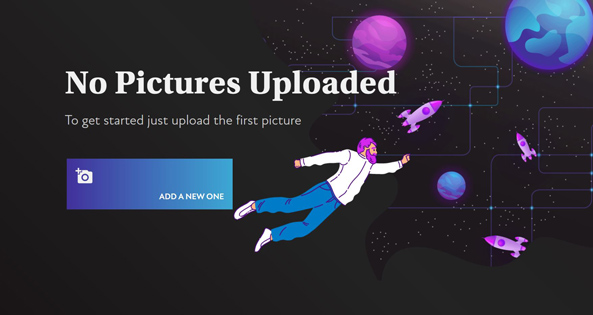
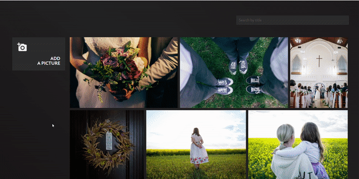

# Picture storage — test app

Easy app to store pictures.

To create the app, I used the Django framework, React.js, and MongoDB. It's my first app with React, so I am very open to your comments and suggestions! Note, that I used React.js just partially for the front-end (to create the gallery), other parts were made with Django templates. It's not best practice, but I did it to save development time. In the future, I am ready to go deeper into React and do apps more homogenously.
## Requirements

Before running the app make sure you have a fresh version of [Node.js](https://nodejs.org/en/download/) and [MongoDB](https://docs.mongodb.com/manual/installation/) installed (and Python of course).

Besides, you also **have to install other requirements**. 
Use the package manager [pip](https://pip.pypa.io/en/stable/) and [npm](https://www.npmjs.com/) for this.

In the beginning, you can easily install all the required Python libs in one command: 

```bash
pip install -r requirements.txt
```

If you want to edit the React app, you need to set up React, webpack, and babel. For this, just move to the `apps/frontend` folder and install dependencies: 

_(But it's not necessary to do it to use app. Only for developing)_

```bash
cd ./apps/frontend && npm install
```

## Run

First time, you need to set the database structure. For this just run it:

```bash
python manage.py makemigrations store
python manage.py migrate store
```

After that needs to create a database user:

```bash
python manage.py createsuperuser
```

Enter a user name, password. You can skip email.

Now, we're ready to run the app!

```bash
python manage.py runserver
```

**And, at last, it is very important to create a few records of Categories in Django-Admin** `http://127.0.0.1:8000/admin/`

## Preview




